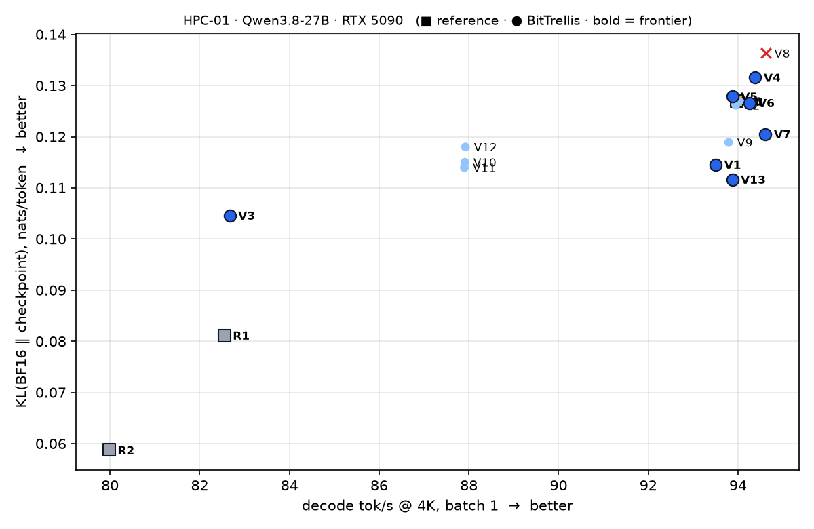
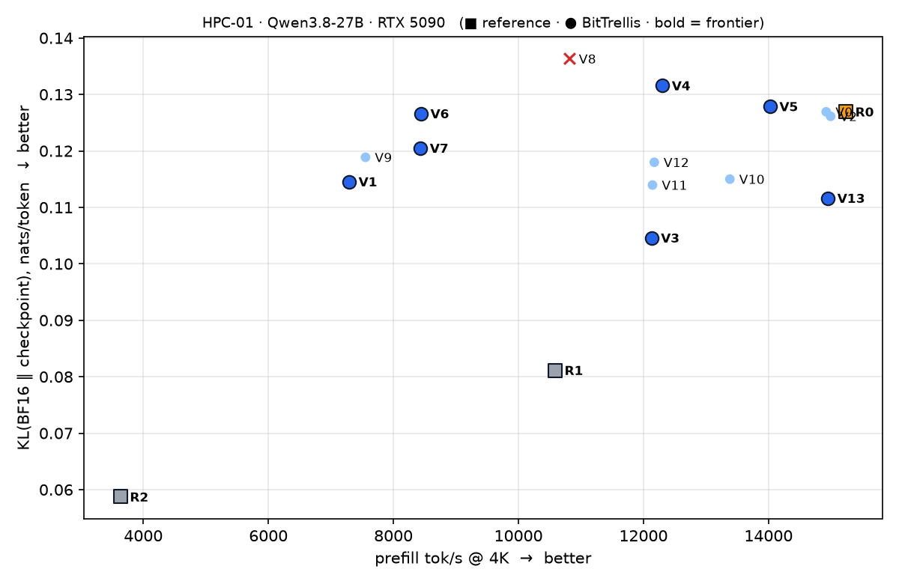

# BitTrellis

### Every layer doesn't deserve the same bits.

**One model. One GPU. Find the precision map the hardware actually wants.**

A 27-billion-parameter model is not numerically uniform. Some projections shrug off 4-bit
weights; some carry recurrent state that quietly compounds every rounding error across 32,000
tokens. The kernel that runs a format fast on one GPU can be the slow path on the next.

Yet almost every checkpoint ships with **one precision stamped on every layer.**

**BitTrellis searches for the map instead:** which parts of the model run at which precision,
built into a real checkpoint, audited, and measured on the real card.

```text
                           B I T T R E L L I S

   Qwen3.8-27B (BF16)   ──┐
                          │   ┌───────────────────────────────┐
   precision manifest   ──┼──▶│ build   ▸ bytes the runtime   │
   (273 units)            │   │           actually executes   │
                          │   │ audit   ▸ nothing but          │
   pinned SparkInfer    ──┘   │           precision changed    │
                              │ measure ▸ KL vs BF16 · tok/s · │
                              │           VRAM · tasks         │
                              └───────────────┬───────────────┘
                                              ▼
                                  deployable checkpoint
                                              │
                              SparkInfer ──▶ 1× RTX 5090 ──▶ frontier
```

<!-- STATUS -->

## Status: feasibility passed ✅, search is open

Before building a search engine, BitTrellis had to prove there is something to search for. Seventeen
checkpoints were measured on one RTX 5090 against a pre-registered verdict rule.

> **STRONG PASS.** SparkInfer's shipped Qwen3.8-27B checkpoint is **not on the frontier**. A
> BitTrellis map with the same speed and memory diverges **12% less** from BF16, and six other
> maps open trade-offs the shipped checkpoint doesn't offer.

What the data says, in one line each:

- **Where bits go matters more than how many.** At the same 4.5 bits, maps move prefill −52%, VRAM ±1.9 GiB, KL −18%.
- **Depth is capability.** Protecting shallow recurrent layers fixes long context (KL 0.089 → 0.037); deep layers fix math (0.174 → 0.109).
- **Effects don't add.** Two changes combined measure −0.012 nats from their sum (95% CI excludes 0).
- **Kernels have opinions.** The first layer's format picks the prefill path for the whole model, a 28% swing that no bits-per-weight model predicts.

Full report: [`results/feasibility/feasibility_report.md`](results/feasibility/feasibility_report.md)

<!-- /STATUS -->

---

## What we race against

A benchmark that only beats itself can report any number it likes. BitTrellis measures three
**external reference points** with exactly the same harness, corpus and BF16 reference as every
candidate:

| | Reference point | Precision map | Why it's here |
|---|---|---|---|
| **R0** | [gittensor NVFP4](https://huggingface.co/gittensor-model-hub/Qwen3.8-27B-NVFP4-RTX5090) on SparkInfer | NVFP4 on all 400 Linears + head | what SparkInfer ships and scores today |
| **R1** | [unsloth NVFP4](https://huggingface.co/unsloth/Qwen3.8-27B-NVFP4) on SparkInfer | hand-tuned NVFP4 MLP + FP8 attention/GDN/head | an expert's mixed map for the same model |
| **R2** | [unsloth UD-Q4_K_M](https://huggingface.co/unsloth/Qwen3.8-27B-GGUF) on **llama.cpp** | imatrix-guided Q4_K/Q5_K/Q6_K mix | the llama.cpp ecosystem's best answer |

NVIDIA's official NVFP4 build is recorded too. It **does not load** on the pinned runtime: its
FP8 scales are per-tensor, and SparkInfer reads only per-row FP8.

<!-- FRONTIER -->

```text
╭──────────────────────────────────────────────────────────────────────────────╮
│  HPC-01 FRONTIER · Qwen3.8-27B · 1× RTX 5090 · SparkInfer b1ed168 · 2 reps   │
╰──────────────────────────────────────────────────────────────────────────────╯
                                        KL vs BF16   decode   prefill   VRAM
                                          ↓ nats      ↑ tok/s  ↑ tok/s   ↓ GiB
  ★ R2  llama.cpp · UD-Q4_K_M               0.059       80.0     3,635   16.2
  ★ R1  unsloth · NVFP4 + FP8               0.081       82.5    10,588   23.6
  ·  R0  gittensor NVFP4 · shipped today    0.127       94.0    15,238   22.0
  ★ V13 R0 map + calibrated MLP bytes       0.112       93.9    14,952   22.0   ◀ dominates R0
  ★ V3  GDN FP8                             0.105       82.7    12,129   23.9
  ★ V1  all Q4_K                            0.115       93.5     7,294   20.2
  ★ V7  MLP Q4_K, layers 0–31               0.121       94.6     8,434   21.4
  ★ V6  MLP Q4_K                            0.127       94.3     8,443   20.8
  ★ V5  attention Q4_K                      0.128       93.9    14,025   21.8
  ★ V4  GDN Q4_K                            0.132       94.4    12,304   21.6

  ★ = on the ε-frontier (not dominated beyond measurement noise on any of the 4 objectives)
```

<p align="center">
  
  
</p>

**Against llama.cpp.** llama.cpp's best GGUF (R2) is the most accurate and the smallest point
measured, but it decodes **15% slower** and prefills **4.2× slower** than SparkInfer's maps.
SparkInfer's shipped checkpoint (R0) has the speed but diverges **2.2× more**. The open
territory between them is where BitTrellis maps compete.

<!-- /FRONTIER -->

---

## 🎯 Current target — HPC-01

| | |
|---|---|
| Model | Qwen3.8-27B: 64 layers, 48 Gated DeltaNet + 16 full attention, pinned revision |
| GPU | 1× NVIDIA GeForce RTX 5090 (32 GB) |
| Runtime | SparkInfer v0.5.8 @ `b1ed168`, every runtime knob pinned |
| Search space | 273 units × {NVFP4, FP8, Q4_K} where the runtime executes them |
| Quality | KL divergence from BF16 on a fixed 78K-token corpus (21,624 scored positions), plus 8K/16K/32K needles |
| Objectives | KL ↓ · decode tok/s ↑ · prefill tok/s ↑ · peak VRAM ↓ |
| Frozen | architecture, tokenizer, every non-Linear tensor, the weights themselves |

Everything is pinned in [`configs/hpc01.yaml`](configs/hpc01.yaml).

> **Which parts of the model should spend precision, and which can give it up?**

---

## The precision space is what the runtime executes

A checkpoint can *store* any format; what matters is what the loader *runs*. At the pinned commit:

```text
                        stored ▸   NVFP4          FP8 (per row)      BF16
   ─────────────────────────────────────────────────────────────────────────
   GDN  qkv · z · out   runs  ▸   NVFP4          FP8                Q4_K fit
   attention q·k·v·o    runs  ▸   NVFP4          Q4_K refit (!)     Q4_K fit
   MLP  gate·up·down    runs  ▸   NVFP4          Q4_K refit (!)     Q4_K fit
   lm_head (batch 1)    runs  ▸   Q4_K refit     Q4_K refit         Q4_K fit
```

So a manifest names the precision that **runs**, and anything the runtime would silently
convert is rejected. BF16 never executes for a Linear; FP8 only executes on GDN. Details and
line-level evidence: [docs/precision_space.md](docs/precision_space.md).

---

## Five words that do all the work

| Term | Meaning |
|---|---|
| **Unit** | The smallest piece whose precision the runtime lets you choose: `L7.attn.q`, `L40.gdn.z`, `L12.mlp`, `lm_head`. There are 273. |
| **Manifest** | A few lines of YAML that assign a precision to every unit. It *is* the submission. |
| **Audit** | Proof that a checkpoint is nothing but a precision transformation of the pinned weights: bytes, tensor set, reconstruction fidelity, loader resolution. |
| **KL** | How far the checkpoint's next-token distribution is from BF16, teacher-forced through SparkInfer itself. Deterministic, compared *paired* position by position. |
| **Frontier Gain** | The normalized hypervolume a result adds to the KL × decode × prefill × VRAM frontier. It replaces XS/S/M/L/XL labels, which measure effort, not effect. |

---

## Quickstart (no GPU)

```bash
git clone https://github.com/coderbench/bittrellis && cd bittrellis
pip install -e ".[dev]"
pytest -q                                          # build → audit → tamper detection on tiny synthetic models

bittrellis inventory                               # 273 units · 144 GDN · 64 attention · 64 MLP · lm_head
bittrellis manifest experiments/feasibility/variants/V2-lmhead-bf16-source.yaml
```

A manifest:

```yaml
schema: bittrellis/precision-manifest@1
track: HPC-01
name: head-once-gdn-fp8-deep
default: NVFP4
rules:
  - match: "L*.gdn.*"
    layers: "40-63"
    precision: FP8
modules:
  lm_head: Q4_K
```

## On the GPU host

```bash
scripts/setup_sparkinfer.sh                 # pinned SparkInfer build
scripts/setup_models.sh base baseline       # BF16 base + NVFP4 baseline
bittrellis doctor                           # everything pinned and present?
bittrellis reference                        # BF16 reference distributions, once

bittrellis build my.yaml --out models/candidates/mine     # CPU only, deterministic
bittrellis evaluate models/candidates/mine --out artifacts/mine
bittrellis frontier artifacts/*
```

Reproduce the whole feasibility experiment: `experiments/feasibility/run.sh`.

---

## For miners

You don't rewrite the inference engine. You submit a better map for it.

1. Read the measured sensitivities in the [feasibility report](results/feasibility/feasibility_report.md).
2. Write `manifests/<name>.yaml` with a hypothesis in its description.
3. Open a PR. The evaluator builds, audits, scores and benchmarks it on the pinned RTX 5090.
4. Your result earns **Frontier Gain** only if it passes every gate and opens new space.

[Miner guide](docs/miner_guide.md) · [Manifest format](docs/precision_manifest.md) ·
[Evaluation](docs/evaluation.md) · [Frontier](docs/frontier.md)

---

## Repository

```text
bittrellis/
├── configs/hpc01.yaml          every pin: model, runtime, references, gates, frontier box
├── bittrellis/
│   ├── model/qwen38.py         architecture → 273 searchable units
│   ├── precision.py            the runtime-executed precision space + loader resolver
│   ├── manifest.py             rules → expanded map → content-addressed candidate id
│   ├── quant/formats.py        bit-exact BF16 · FP8 E4M3 · NVFP4 codecs (numpy)
│   ├── build.py                manifest → deployable checkpoint (CPU, deterministic)
│   ├── validate.py             audit + describe any checkpoint
│   ├── eval/                   corpus · BF16 reference · KL · bench · tasks · llama.cpp
│   └── frontier/               gates · Pareto · Frontier Gain · reports
├── data/corpus/                pinned, hash-verified evaluation tokens
├── experiments/feasibility/    V0–V9 manifests, runner, analysis
├── results/feasibility/        frontier, comparison, plots, report
├── tools/llamacpp_score.cpp    teacher-forced scoring for the llama.cpp reference
└── docs/
```

## What this repo is not

- not another inference runtime ([SparkInfer](https://github.com/gittensor-ai-lab/sparkinfer) runs the artifact)
- not a generic quantization library
- not a model zoo, a model server, or a training framework
- not a wrapper around `quantize(model, bits=4)`

Existing tools provide number formats. **BitTrellis finds where to put them.**

## Final goal

A sequence of deep, reproducible, hardware-specific frontiers, one model × GPU pair at a time:

```text
today   Qwen3.8-27B × RTX 5090 × SparkInfer
later   next model × RTX 5090   ·   Qwen3.8 × next GPU   ·   …
```

Not every model badly. One pair, optimized properly.

---

Why the design differs from the original blueprint: [docs/blueprint_review.md](docs/blueprint_review.md).
License: MIT.
