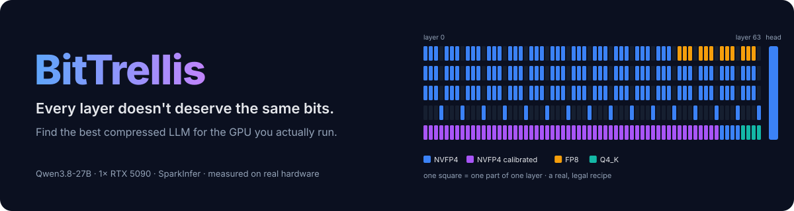
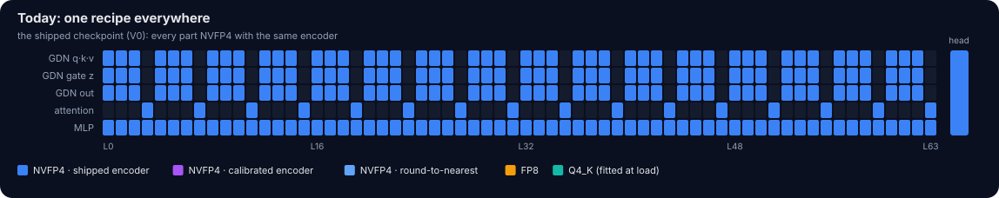
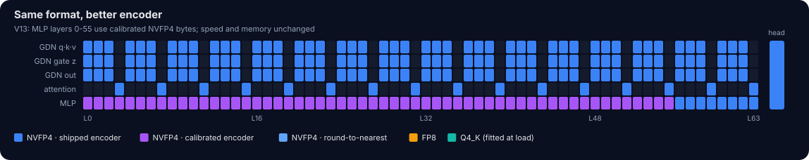
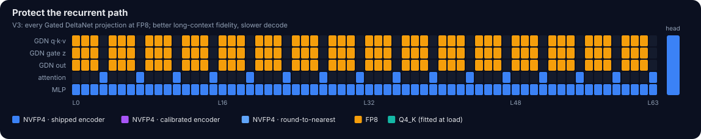
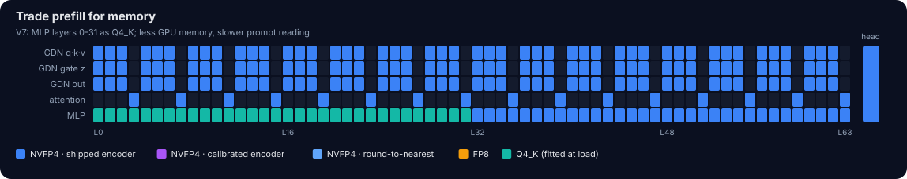
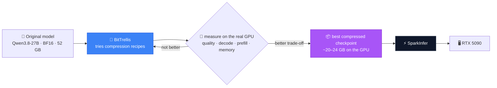
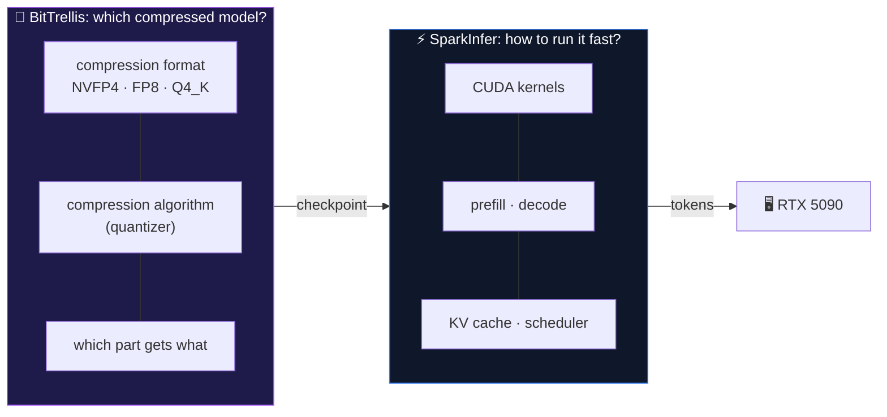
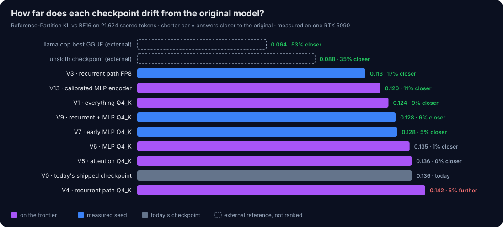
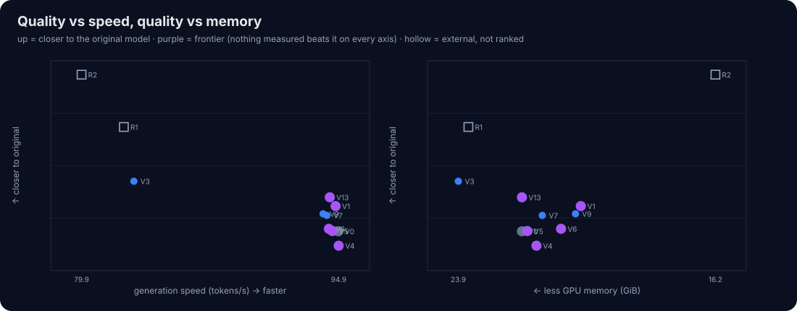

<p align="center">
  
</p>

<h1 align="center">BitTrellis</h1>

<p align="center">
  <a href="https://github.com/coderbench/bittrellis/actions/workflows/ci.yml"></a>
  
  
  
  
</p>

> **BitTrellis automatically searches for the best way to compress an LLM for a particular GPU,
> while keeping as much of the original model's quality as possible.**

## The problem, in plain words

Large language models are too big for consumer GPUs as they are released.

```text
Qwen3.8-27B, original (BF16)        ~52 GB        ✗ does not fit a 32 GB RTX 5090
Qwen3.8-27B, compressed (4-bit)     ~20–24 GB     ✓ fits, with room for long context
```

So the model has to be **compressed** (quantized) into formats such as NVFP4, FP8 or Q4_K. That
makes it fit, but compression always costs a little quality: the compressed model no longer
answers *exactly* like the original.

The usual approach uses one recipe for the whole model:

```text
layer 1 → NVFP4    layer 2 → NVFP4    …    layer 64 → NVFP4      (same method everywhere)
```

But the parts of a model do not react to compression in the same way. Some layers tolerate
aggressive compression perfectly. Some lose noticeably more quality. And some improve simply by
using a **better compression algorithm**, even when the format stays the same.

**BitTrellis asks: what is the best compression recipe for this exact model on this exact GPU?**

## What BitTrellis does

It tries different recipes, builds each one into a real checkpoint, and measures it on the real GPU.
Each picture below is a real recipe: one square per part of one layer, colored by how it is compressed.

<p align="center"></p>
<p align="center"></p>
<p align="center"></p>
<p align="center"></p>

For every candidate it answers four questions:

| | Question | Why it matters |
|---|---|---|
| 1 | **How close is it to the original model?** | quality you keep |
| 2 | How fast does it generate text (decode)? | chat and agent speed |
| 3 | How fast does it read a long prompt (prefill)? | time to first token |
| 4 | How much GPU memory does it need? | what fits, how much context |

The repository keeps the **best trade-offs** and publishes the checkpoints that win.



## An improvement looks like this

```text
Today's checkpoint      speed 95 tok/s · memory 22 GB · closeness to original: good
BitTrellis checkpoint   speed 95 tok/s · memory 22 GB · closeness to original: better
```

Same GPU, same speed, same memory, but the model behaves more like the original. That is a real
improvement. The first measurements already found one that comes close (numbers below).

A result that keeps quality while needing less memory, or that offers a better overall balance,
counts too. **BitTrellis is not mainly a speed project.** It is about keeping quality while
fitting the hardware.

## BitTrellis vs SparkInfer



| | [SparkInfer](https://github.com/gittensor-ai-lab/sparkinfer) | BitTrellis |
|---|---|---|
| Question | *How can we run this model faster?* | *Which compressed version of the model should run?* |
| Works on | CUDA kernels, prefill, decode, scheduling, KV cache | compression format, compression algorithm, which parts get which, quality vs memory |
| In short | **a better engine** | **a better version of the model for that engine** |

---

<!-- STATUS -->
## 📊 What the first measurements found

> **Verdict: PASS.** Different recipes really do trade quality, speed and memory differently on the
> RTX 5090, and no recipe wins everything. That is exactly what makes a search worth running.
> Full numbers: [feasibility report](results/feasibility/feasibility_report.md).

<p align="center"></p>

In plain words:

- 🏆 **Best balance so far: V13.** Same recipe as today's checkpoint, but a better encoder for the MLP
  layers. It stays **~12% closer to the original** at the same generation speed and the same memory.
  The price: it reads long prompts **~4% slower**.
- 🧮 **Different parts guard different skills.** A better MLP encoder halves the drift on math.
  Giving the recurrent layers 8 bits cuts long-document drift by 62%, but generates 13% slower.
- 🧩 **Changes don't simply add up.** Two changes together behave differently from each one alone,
  so combinations have to be measured.
- 🚀 **Plenty of headroom.** Reference checkpoints outside SparkInfer stay 35–53% closer to the
  original, at a large speed cost. Getting that quality at SparkInfer speed is the open problem.
<!-- /STATUS -->

---

<!-- FRONTIER -->
## 🗺️ The frontier today

The **frontier** is the set of checkpoints that nothing else beats on every axis at once. A new
result earns credit only if it pushes this set forward.

<p align="center"></p>

| | Checkpoint | Drift from original ↓ | Generation tok/s ↑ | 4K prompt tok/s ↑ | Peak GPU GiB ↓ |
|---|---|---:|---:|---:|---:|
| ★ | **V13** calibrated MLP encoder | **0.120** (−11.5%) | 94.4 | 14,110 | 22.0 |
| ★ | V1 everything Q4_K | 0.124 | 94.8 | 7,537 | **20.3** |
| ★ | V6 MLP Q4_K | 0.135 | 94.4 | 8,358 | 20.8 |
| ★ | V5 attention Q4_K | 0.136 | 94.6 | 13,571 | 21.9 |
| ★ | **V0** today's shipped checkpoint | 0.136 | **94.9** | **14,760** | 22.0 |
| ★ | V4 recurrent path Q4_K | 0.142 | 94.9 | 12,011 | 21.6 |
| | V3 recurrent path FP8 | 0.113 | 83.0 | 11,848 | 23.9 |

Drift is Reference-Partition KL against the BF16 original; Δ is paired against V0 with a 95%
interval that excludes zero. Every row passes every gate. V3, V7 and V9 were measured and are beaten
by a frontier point.

### Comparison targets

Like llama.cpp is SparkInfer's yardstick, BitTrellis measures two outside checkpoints on the same GPU,
with the same corpus and the same metric. They show what is possible but are never ranked: llama.cpp is a different engine, and the unsloth
checkpoint is not a legal manifest (its FP8 attention bytes are silently refit to Q4_K at load).

| | Reference | Drift ↓ | Generation tok/s ↑ | 4K prompt tok/s ↑ | Peak GPU GiB ↓ |
|---|---|---:|---:|---:|---:|
| R2 | **llama.cpp** + unsloth UD-Q4_K_M GGUF | 0.064 | 79.9 | 3,616 | 16.2 |
| R1 | unsloth NVFP4 checkpoint on SparkInfer | 0.088 | 82.4 | 10,305 | 23.6 |
| R3 | NVIDIA NVFP4 checkpoint | — | — | — | — |

R3 cannot load on the pinned SparkInfer: its FP8 scales are per tensor, and the loader accepts only
per-row scales. It marks the compatibility boundary.

The target for miners: move the SparkInfer frontier toward the references' quality without giving
up SparkInfer's speed.
<!-- /FRONTIER -->

---

# How it works (technical)

## 🎯 Current target: HPC-01

| | |
|---|---|
| Model | Qwen3.8-27B: 64 layers, 48 Gated DeltaNet + 16 full attention; BF16 weights hash-locked |
| GPU | 1× NVIDIA GeForce RTX 5090 (32 GB) |
| Runtime | SparkInfer v0.5.8 @ `b1ed168`, kernels unmodified, every runtime knob pinned |
| Search space | 273 units × legal execution format × legal quantizer |
| Fidelity | **Reference-Partition KL** vs BF16 on a 78K-token corpus (21,624 scored positions) |
| Objectives | RP-KL ↓ · decode tok/s ↑ · 4K prefill tok/s ↑ · peak GPU memory ↓ |
| Guards | audit · runtime correctness · 8K/16K/32K needles · task guard · private holdout |
| Frozen | architecture, tokenizer, every non-searchable tensor, the BF16 source weights |

Everything is pinned in [`configs/hpc01.yaml`](configs/hpc01.yaml) and
[`configs/sources.lock.json`](configs/sources.lock.json). The rules are in the
[specification](docs/specification.md).

> **Which parts of the model should spend precision, which encoder should produce their bytes,
> and which parts can give it up?**

---

## What runs is what counts

A checkpoint can *store* anything; the pinned loader decides what *executes*:

```text
                        stored ▸   NVFP4          FP8 (per row)      BF16
   ─────────────────────────────────────────────────────────────────────────
   GDN  qkv · z · out   runs  ▸   NVFP4          FP8                Q4_K fit
   attention q·k·v·o    runs  ▸   NVFP4          Q4_K refit (!)     Q4_K fit
   MLP  gate·up·down    runs  ▸   NVFP4          Q4_K refit (!)     Q4_K fit
   lm_head   batch 1    runs  ▸   Q4_K refit     Q4_K refit         Q4_K fit
             packed     runs  ▸   NVFP4*         Q4_K refit         Q4_K fit      * if VRAM allows
```

A manifest names what **runs**; anything the runtime would silently convert is rejected. Q4_K is a
runtime fit with no encoder choice. FP8 executes only on GDN. Evidence, down to loader line numbers:
[docs/precision_space.md](docs/precision_space.md).

---

## Six words that do all the work

| Term | Meaning |
|---|---|
| **Unit** | The smallest piece whose format the runtime lets you choose: `L7.attn.q`, `L40.gdn.z`, `L12.mlp`, `lm_head`. There are 273. |
| **Manifest** | A few lines of YAML assigning `format @ quantizer` to every unit. It *is* the submission. |
| **Quantizer** | What produces a unit's bytes: `runtime` (Q4_K), `rtn` (regenerable), `baseline` / `unsloth` (attested), or [yours](docs/quantizer_contract.md). |
| **Audit** | Proof that a checkpoint is nothing but legal encodings of the hash-locked weights: every source verified, frozen tensors byte-identical, regenerable units rebuilt byte-for-byte. |
| **RP-KL** | Reference-Partition KL: the candidate's next-token distribution vs BF16's, both projected onto BF16's top-256 tokens plus a tail bucket. Same partition for every candidate, never larger than full KL, compared *paired* position by position. |
| **FG-2** | Frontier Gain: the normalized 4-D hypervolume a result adds to the internal frontier. It replaces effort-based size labels with measured effect. |

---

## Quickstart (no GPU)

```bash
git clone https://github.com/coderbench/bittrellis && cd bittrellis
pip install -e ".[dev]"
pytest -q                                   # build · audit · lineage · tamper detection · RP-KL · frontier

bittrellis quantizers                       # runtime · baseline · unsloth · rtn
bittrellis inventory                        # 273 units · 144 GDN · 64 attention · 64 MLP · lm_head
bittrellis manifest experiments/feasibility/variants/V13-mlp-unsloth-bytes.yaml --expand
```

A manifest:

```yaml
schema: bittrellis/manifest@2
track: HPC-01
name: calibrated-mlp-gdn-fp8-deep-qkv
default: NVFP4
rules:
  - match: "L*.mlp"
    layers: "0-55"
    format: NVFP4
    quantizer: unsloth          # calibrated bytes, attested
  - match: "L*.gdn.qkv"
    layers: "48-63"
    format: FP8                 # protect the deep state-writing projections
```

## On an RTX 5090 host

```bash
scripts/setup_sparkinfer.sh                 # pinned runtime + the quality-measuring tool
scripts/setup_models.sh                     # base · shipped · unsloth, hash-verified
bittrellis doctor
bittrellis reference                        # BF16 reference distributions, once

bittrellis build manifests/mine.yaml --out models/candidates/mine
bittrellis evaluate models/candidates/mine --out artifacts/mine
bittrellis compare results/feasibility/artifacts/V0-baseline-rebuild artifacts/mine
bittrellis frontier --with-seeds artifacts/mine
```

---

## For miners

You don't rewrite the inference engine. You submit a better artifact for it.

1. Read what the seeds measured: [feasibility report](results/feasibility/feasibility_report.md).
2. Write `manifests/<name>.yaml`, or a new quantizer plus the manifest that uses it.
3. Open a PR. The [evaluator bot](evaluator/pr_bot.py) builds, audits, scores, benchmarks and holdout-checks it on the pinned RTX 5090, then comments with a paired comparison against V0 and your FG-2.
4. Only results that pass every gate and open new frontier space earn gain; duplicates earn nothing.

[Miner guide](docs/miner_guide.md) · [Manifests](docs/precision_manifest.md) ·
[Quantizer contract](docs/quantizer_contract.md) · [Evaluation](docs/evaluation.md) ·
[Frontier](docs/frontier.md) · [Search](docs/search.md) · [Holdout](docs/holdout.md)

---

## Repository

```text
bittrellis/
├── configs/                 hpc01.yaml (every pin) · sources.lock.json (every source file hash)
├── bittrellis/
│   ├── model/qwen38.py      config + loader contract → 273 units
│   ├── precision.py         legal formats, loader resolver, executed-format semantics
│   ├── manifest.py          rules → FORMAT@quantizer@vN per unit → candidate id
│   ├── quantizers/          plugin contract · runtime · attested · regenerable (+ yours)
│   ├── lineage.py           source hash verification
│   ├── build.py             deterministic checkpoint writer (CPU)
│   ├── validate.py          audit: frozen bytes, execution map, lineage replay + cache
│   ├── eval/                corpus · BF16 reference · RP-KL · tasks · 2-run perf · llama.cpp
│   ├── holdout.py           private rotating holdout, PASS/FAIL
│   ├── frontier/            gates · ε-dominance · FG-2 · reports
│   └── search.py            baseline one-group neighbors
├── tools/                   programs that measure how close a checkpoint stays to the original
├── evaluator/               PR bot for validators
├── data/corpus/             public fidelity corpus (hash-verified)
├── experiments/feasibility/ seed manifests, pipelined runner, analysis
├── results/feasibility/     seed artifacts = initial internal frontier, report, plots
└── docs/                    specification · architecture · guides
```

## What this repo is not

- not another inference runtime ([SparkInfer](https://github.com/gittensor-ai-lab/sparkinfer) executes the artifact)
- not a generic quantization library, model zoo, server or training framework
- not a wrapper around `quantize(model, bits=4)`

Quantization libraries provide primitives. SparkInfer provides execution. **BitTrellis searches the
deployable artifact between them.**

## Final goal

A sequence of deep, reproducible, hardware-specific frontiers, one model × runtime × GPU at a time:

```text
today   Qwen3.8-27B × SparkInfer × RTX 5090
later   next model × RTX 5090   ·   Qwen3.8 × next GPU   ·   …   (each its own track and epoch)
```

---

[Specification v2.1](docs/specification.md) · [Architecture](docs/architecture.md) ·
[Audit](docs/audit.md) · [Security](SECURITY.md) · [Blueprint review](docs/blueprint_review.md) · MIT license
