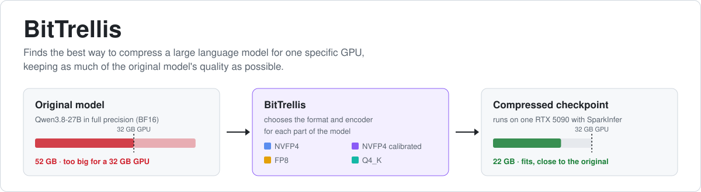
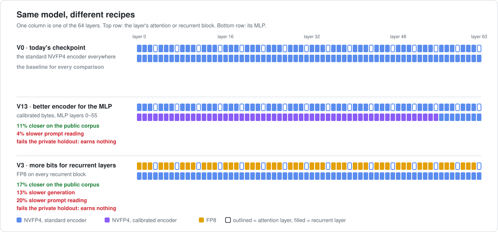
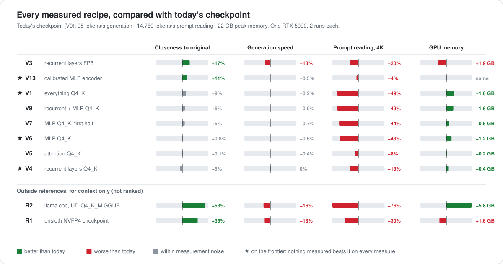
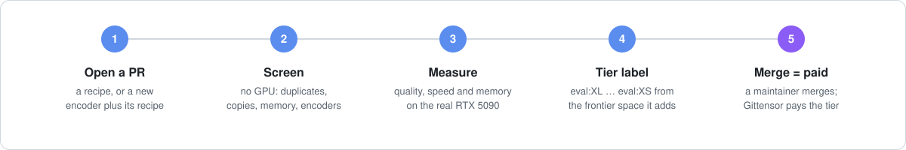
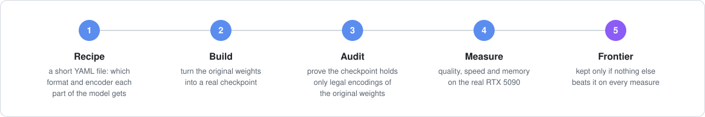

<p align="center">
  
</p>

<p align="center">
  <a href="https://github.com/coderbench/bittrellis/actions/workflows/ci.yml"></a>
  
  
  
  
  <a href="https://github.com/coderbench/bittrellis-ledger"></a>
  
</p>

<p align="center">
  <a href="#the-problem">Problem</a> ·
  <a href="#what-the-first-measurements-found">Results</a> ·
  <a href="#mine-it">Mine it</a> ·
  <a href="#how-it-works">How it works</a> ·
  <a href="#docs">Docs</a>
</p>

> **BitTrellis automatically searches for the best way to compress an LLM for a particular GPU,
> while keeping as much of the original model's quality as possible.**

## The problem

Qwen3.8-27B needs about **52 GB** as released. An RTX 5090 has **32 GB**. So the model must be
**compressed** (quantized) into formats like NVFP4, FP8 or Q4_K. It then fits, but it no longer
answers *exactly* like the original.

The usual approach uses one recipe everywhere:

```text
layer 1 → NVFP4    layer 2 → NVFP4    …    layer 64 → NVFP4
```

But layers are not equal. Some shrug off compression, some lose quality, and some improve just by
using a **better compression algorithm** in the same format. So the real question is:

**What is the best compression recipe for this exact model on this exact GPU?**

## What BitTrellis does

It tries recipes, builds each one into a real checkpoint, and measures it on the real GPU. Each
column below is one layer; the color is how that part is compressed.

<p align="center"></p>

Every candidate answers four questions, and only the best trade-offs survive:

| | Question | Why it matters |
|---|---|---|
| 1 | **How close is it to the original model?** | the quality you keep |
| 2 | How fast does it generate text? | chat and agent speed |
| 3 | How fast does it read a long prompt? | time to first token |
| 4 | How much GPU memory does it need? | what fits, how much context |

**A win looks like this:** same speed, same memory, but the model behaves more like the original.
Using less memory at the same quality, or a better overall balance, counts too. **BitTrellis is not
mainly a speed project** — it is about keeping quality while fitting the hardware.

| | [SparkInfer](https://github.com/gittensor-ai-lab/sparkinfer) | BitTrellis |
|---|---|---|
| Asks | *How can we run this model faster?* | *Which compressed version should run?* |
| Works on | CUDA kernels, prefill, decode, KV cache | formats, encoders, which parts get which |
| In short | **a better engine** | **a better model for that engine** |

---

<!-- STATUS -->
## What the measurements found

> **The private holdout changed the answer.** The recipe that looked best on the public corpus does
> not hold up on text nobody has seen, so it earns nothing. What survives is memory savings.
> Full numbers: [feasibility report](results/feasibility/feasibility_report.md).

<p align="center"></p>

- **A public gain is not a real gain.** V13 (a calibrated MLP encoder) is 11.5% closer to the
  original on the public corpus, but only 2.9% closer on the private holdout: **9% of the gain
  carries over**, against the 50% the rule requires. It fails. V3 (8-bit recurrent layers) carries
  44% over and also fails.
- **What does survive: memory.** Q4_K maps keep quality within noise and save real memory — V1
  −1.8 GiB, V6 −1.2 GiB — and they pass the holdout. The price is prompt reading, up to −49%.
- **Fidelity is not task accuracy.** On all 784 task questions the spread is small: V1 575, V0 570,
  V13 566. Drift measures how closely a model copies the original, not whether it is smarter.
- **Plenty of headroom.** Outside references are 35–53% closer to the original on the public corpus,
  at a large speed cost. Whether that carries over to unseen text is untested.
<!-- /STATUS -->

<!-- FRONTIER -->
### The frontier today

The **frontier** is the set of checkpoints nothing else beats on every measure at once, *after* every
gate. New results earn only by pushing it forward.

| | Checkpoint | Drift ↓ | Tasks ↑ | Generation tok/s ↑ | 4K prompt tok/s ↑ | Peak GPU GiB ↓ | Holdout |
|---|---|---:|---:|---:|---:|---:|---|
| ★ | V1 everything Q4_K | 0.124 | **575/784** | 94.8 | 7,537 | **20.3** | PASS |
| ★ | V6 MLP Q4_K | 0.135 | 563/784 | 94.4 | 8,358 | 20.8 | PASS |
| ★ | **V0** today's shipped checkpoint | 0.136 | 570/784 | **94.9** | **14,760** | 22.0 | incumbent |
| ★ | V4 recurrent path Q4_K | 0.142 | 566/784 | 94.9 | 12,011 | 21.6 | PASS |
| ✗ | V3 recurrent path FP8 | 0.113 | 573/784 | 83.0 | 11,848 | 23.9 | **FAIL** (44% transfers) |
| ✗ | V13 calibrated MLP encoder | 0.120 | 566/784 | 94.4 | 14,110 | 22.0 | **FAIL** (9% transfers) |
| ✗ | V5 attention Q4_K | 0.136 | 556/784 | 94.6 | 13,571 | 21.9 | task guard: −33 answers |

Drift is Reference-Partition KL against the BF16 original: how far next-token predictions move, not
task accuracy. ✗ rows are measured but cannot be credited. V7 and V9 are valid but beaten by a
frontier point.

**Comparison targets.** Just as llama.cpp is SparkInfer's yardstick, BitTrellis measures outside
checkpoints on the same GPU, corpus and metric. They show what is possible but are never ranked:

| | Reference | Drift ↓ | Generation tok/s ↑ | 4K prompt tok/s ↑ | Peak GPU GiB ↓ |
|---|---|---:|---:|---:|---:|
| R2 | **llama.cpp** + unsloth UD-Q4_K_M GGUF | 0.064 | 79.9 | 3,616 | 16.2 |
| R1 | unsloth NVFP4 checkpoint on SparkInfer | 0.088 | 82.4 | 10,305 | 23.6 |
| R3 | NVIDIA NVFP4 checkpoint | — | — | — | — |

llama.cpp is a different engine. The unsloth checkpoint is not a legal manifest (its FP8 attention
bytes are silently refit to Q4_K at load). R3 cannot load at all: its FP8 scales are per tensor, and
the pinned loader accepts only per-row scales.

**The miner's target:** a fidelity gain that survives the private holdout. Nothing has managed one yet.
<!-- /FRONTIER -->

---

## Mine it

You don't rewrite the inference engine. You submit a better model for it — and get paid on
[Gittensor](https://github.com/entrius/gittensor) when it merges.

<p align="center"></p>

1. **Read what the seeds measured** in the [feasibility report](results/feasibility/feasibility_report.md).
2. **Write a recipe**, `manifests/<name>.yaml`, or a new quantizer plus the recipe that uses it.
3. **Open a PR.** The [evaluator bot](evaluator/pr_bot.py) screens it, measures it, and comments with the score.
4. **Get a tier** — the only thing Gittensor pays, when a maintainer merges the PR:

| Tier | Frontier space added beyond noise (FG-2) | Proposed multiplier |
|---|---|---:|
|  | ≥ 0.50% | ×4.0 |
|  | ≥ 0.25% | ×2.5 |
|  | ≥ 0.12% | ×1.5 |
|  | ≥ 0.035% | ×1.0 |
|  | ≥ 0.005% | ×0.5 |
|   | nothing new, or failed | ×0 |

For scale: on today's frontier V0 scores `eval:XL`, V4 and V1 `eval:S`, V6 `eval:XS`. A tier also needs a private holdout PASS: V13 and V3 have none, so they earn nothing. Duplicates earn nothing, and a near-copy of
an earlier PR earns only what it adds.

**Start here:** [Miner guide](docs/miner_guide.md) · [Rewards](docs/rewards.md) · [Guards](docs/guards.md)

### Try it without a GPU

```bash
git clone https://github.com/coderbench/bittrellis && cd bittrellis
pip install -e ".[dev]"
pytest -q                                   # build · audit · tamper detection · RP-KL · frontier · bot

bittrellis quantizers                       # runtime · baseline · unsloth · rtn
bittrellis inventory                        # 273 units · 144 GDN · 64 attention · 64 MLP · lm_head
bittrellis manifest experiments/feasibility/variants/V13-mlp-unsloth-bytes.yaml --expand
```

A recipe is a few lines of YAML:

```yaml
schema: bittrellis/manifest@2
track: HPC-01
name: calibrated-mlp-gdn-fp8-deep-qkv
default: NVFP4
rules:
  - match: "L*.mlp"
    layers: "0-55"
    format: NVFP4
    quantizer: unsloth          # calibrated bytes, attested
  - match: "L*.gdn.qkv"
    layers: "48-63"
    format: FP8                 # protect the deep state-writing projections
```

<details>
<summary><b>Measure it yourself on an RTX 5090</b></summary>

```bash
scripts/setup_sparkinfer.sh                 # pinned runtime + the quality-measuring tool
scripts/setup_models.sh                     # base · shipped · unsloth, hash-verified
bittrellis doctor
bittrellis reference                        # BF16 reference distributions, once

bittrellis build manifests/mine.yaml --out models/candidates/mine
bittrellis evaluate models/candidates/mine --out artifacts/mine
bittrellis compare results/feasibility/artifacts/V0-baseline-rebuild artifacts/mine
bittrellis frontier --with-seeds artifacts/mine
```

</details>

---

## How it works

<p align="center"></p>

### The track: HPC-01

| | |
|---|---|
| Model | Qwen3.8-27B: 64 layers, 48 Gated DeltaNet + 16 full attention; BF16 weights hash-locked |
| GPU | 1× NVIDIA GeForce RTX 5090 (32 GB) |
| Runtime | SparkInfer v0.5.8 @ `b1ed168`, kernels unmodified, every runtime knob pinned |
| Search space | 273 units × legal execution format × legal quantizer |
| Fidelity | **Reference-Partition KL** vs BF16 on a 78K-token corpus (21,624 scored positions) |
| Objectives | RP-KL ↓ · decode tok/s ↑ · 4K prefill tok/s ↑ · peak GPU memory ↓ |
| Guards | screen · audit · runtime correctness · 8K/16K/32K needles · task guard · private holdout |
| Frozen | architecture, tokenizer, every non-searchable tensor, the BF16 source weights |

Everything is pinned in [`configs/hpc01.yaml`](configs/hpc01.yaml) and
[`configs/sources.lock.json`](configs/sources.lock.json). The rules are in the
[specification](docs/specification.md).

### Key terms

| Term | Meaning |
|---|---|
| **Unit** | The smallest piece whose format the runtime lets you choose: `L7.attn.q`, `L40.gdn.z`, `L12.mlp`, `lm_head`. There are 273. |
| **Manifest** | A few lines of YAML assigning `format @ quantizer` to every unit. It *is* the submission. |
| **Quantizer** | What produces a unit's bytes: `runtime` (Q4_K), `rtn` (regenerable), `baseline` / `unsloth` (attested), or [yours](docs/quantizer_contract.md). |
| **Audit** | Proof that a checkpoint is nothing but legal encodings of the hash-locked weights. |
| **RP-KL** | How far next-token predictions drift from BF16, on BF16's top-256 tokens plus a tail bucket. Never larger than full KL; compared position by position. |
| **FG-2** | Frontier Gain: the share of the normalized quality × speed × memory space a result adds. It decides the tier. |

<details>
<summary><b>What runs is what counts</b> — the loader decides the executed format</summary>

A checkpoint can *store* anything; the pinned loader decides what *executes*:

```text
                        stored ▸   NVFP4          FP8 (per row)      BF16
   ─────────────────────────────────────────────────────────────────────────
   GDN  qkv · z · out   runs  ▸   NVFP4          FP8                Q4_K fit
   attention q·k·v·o    runs  ▸   NVFP4          Q4_K refit (!)     Q4_K fit
   MLP  gate·up·down    runs  ▸   NVFP4          Q4_K refit (!)     Q4_K fit
   lm_head   batch 1    runs  ▸   Q4_K refit     Q4_K refit         Q4_K fit
             packed     runs  ▸   NVFP4*         Q4_K refit         Q4_K fit      * if VRAM allows
```

A manifest names what **runs**; anything the runtime would silently convert is rejected. Q4_K is a
runtime fit with no encoder choice. FP8 executes only on GDN. Evidence, down to the loader functions:
[docs/precision_space.md](docs/precision_space.md).

</details>

<details>
<summary><b>Repository layout</b></summary>

```text
bittrellis/
├── configs/                 hpc01.yaml (every pin, gates, tiers) · sources.lock.json (every source hash)
├── bittrellis/
│   ├── model/qwen38.py      config + loader contract → 273 units
│   ├── precision.py         legal formats, loader resolver, executed-format semantics
│   ├── manifest.py          rules → FORMAT@quantizer@vN per unit → candidate id
│   ├── quantizers/          plugin contract · runtime · attested · regenerable (+ yours)
│   ├── build.py             deterministic checkpoint writer (CPU)
│   ├── validate.py          audit: frozen bytes, execution map, lineage replay
│   ├── fingerprint.py       encoder fingerprints for the copy guard
│   ├── eval/                corpus · BF16 reference · RP-KL · tasks · 2-run perf · llama.cpp
│   ├── holdout.py           private rotating holdout, PASS/FAIL
│   ├── frontier/            gates · ε-dominance · FG-2 · reports
│   └── search.py            baseline one-group neighbors
├── tools/                   programs that measure how close a checkpoint stays to the original
├── evaluator/               PR bot · guards · sandbox (for validators)
├── data/corpus/             public fidelity corpus (hash-verified)
├── experiments/feasibility/ seed manifests, runner, analysis
├── results/feasibility/     seed artifacts = initial frontier, report, plots
└── docs/                    specification · guides
```

</details>

**What this is not:** another inference runtime, a generic quantization library, or a wrapper around
`quantize(model, bits=4)`. Quantization libraries provide primitives, SparkInfer provides execution,
and **BitTrellis searches the deployable artifact between them** — one model × runtime × GPU at a
time (`today: Qwen3.8-27B × SparkInfer × RTX 5090`; each next model or GPU is its own track).

---

## Docs

| If you want to… | Read |
|---|---|
| start mining | [Miner guide](docs/miner_guide.md) · [Manifests](docs/precision_manifest.md) · [Search](docs/search.md) |
| write an encoder | [Quantizer contract](docs/quantizer_contract.md) · [Precision space](docs/precision_space.md) |
| know how you are scored | [Evaluation](docs/evaluation.md) · [Frontier](docs/frontier.md) · [Rewards](docs/rewards.md) |
| know what is rejected | [Guards](docs/guards.md) · [Audit](docs/audit.md) · [Holdout](docs/holdout.md) · [Security](SECURITY.md) |
| check the published scores | [Score records](https://github.com/coderbench/bittrellis-ledger) · [Rewards](docs/rewards.md#the-public-record) |
| read the rules and evidence | [Specification](docs/specification.md) · [Architecture](docs/architecture.md) · [Feasibility report](results/feasibility/feasibility_report.md) |

MIT license · [Contributing](CONTRIBUTING.md)
