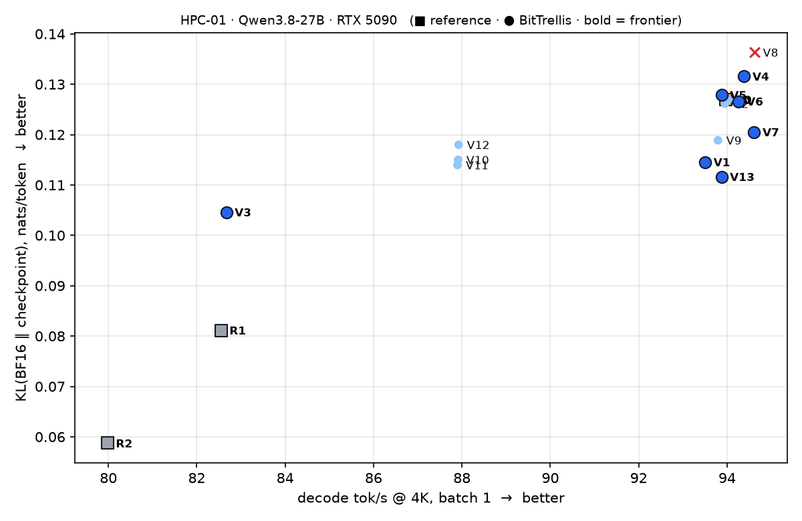
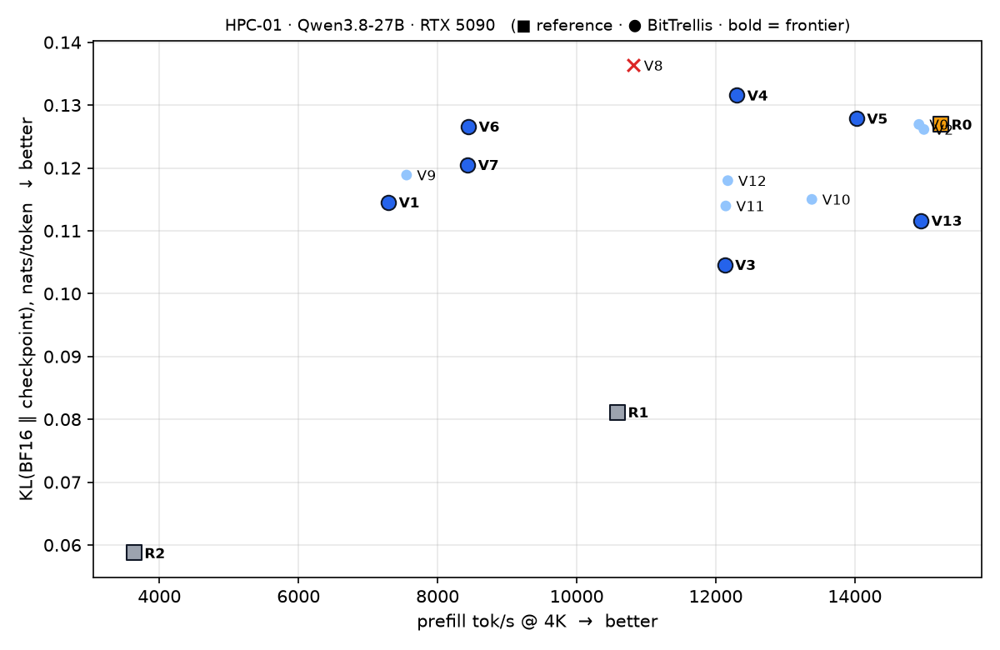
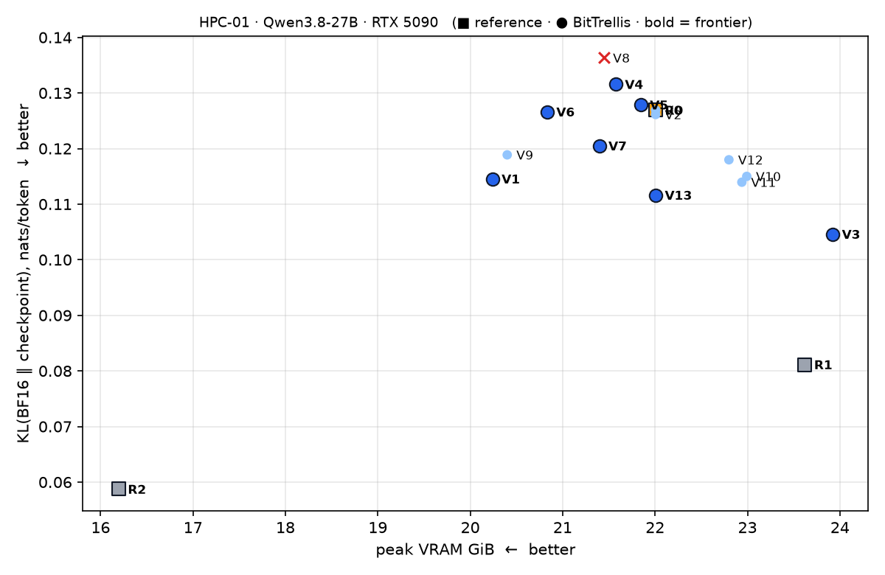

# HPC-01 feasibility report

> **Verdict: STRONG PASS.** Automated precision search is justified.
>
> Measured on one RTX 5090 with SparkInfer `b1ed168`, 2026-09-16. Every number below is
> reproducible from [`artifacts/`](artifacts/) and [`experiments/feasibility/`](../../experiments/feasibility/).

## The short version

- **The checkpoint SparkInfer ships (R0) is not on the frontier.** V13 keeps R0's exact precision
  map but takes calibrated NVFP4 bytes for 56 MLP layers. Against R0 it measures **−12.1% KL**,
  with decode −0.1%, prefill −1.9% and identical peak VRAM, and it passes every gate.
- **Precision topology moves real hardware.** At equal bits, map choices move prefill by up to
  −52%, peak VRAM by −1.8 to +1.9 GiB, and decode by up to −12%.
- **Sensitivity is local, and it interacts.**
  - Depth matters: MLP Q4_K in the shallow half helps KL, in the deep half it hurts and loses a needle.
  - Layers protect different capabilities: shallow GDN FP8 fixes long context, deep GDN FP8 fixes math.
  - Two changes do not add up: the interaction is −0.012 nats, 95% CI [−0.024, −0.002].
- **Kernels make cost non-linear.** The format of the *first* layer of each kind selects the
  batched-prefill path, so maps with the same bytes differ by up to 28% in prefill.

## Setup

| | |
|---|---|
| Model | Qwen/Qwen3.8-27B @ `1d4bf0f2` (BF16 reference); baseline gittensor NVFP4 @ `5b7a687f` |
| Runtime | SparkInfer v0.5.8 @ `b1ed168e`, all `SPARKINFER_*` cleared; scoring in deterministic mode |
| Hardware | 1× RTX 5090 32 GB, driver 580.126.16, CUDA 12.8 |
| Quality | KL(BF16 ‖ checkpoint) over 21,624 teacher-forced positions: 5 × 4K category streams + 8K/16K/32K tails with 9 needles |
| Speed | `qwen3_gguf_bench` sweep 128/4K/16K, 2 reps; peak VRAM polled during the sweep |
| Tasks | SparkInfer `bench/quality` benchmark tier (196 items) through `sparkinfer_server` |

Protocol, variants and the verdict rule were fixed before running: [feasibility_protocol.md](../../docs/feasibility_protocol.md).

## Results

ΔKL is paired against R0 over identical positions (95% block-bootstrap CI). ★ marks the
ε-frontier over KL, decode, prefill and VRAM.

| | Checkpoint | KL | ΔKL vs R0 [95% CI] | decode | prefill | VRAM | tasks | gates |
|---|---|---:|---|---:|---:|---:|---:|---|
| ★ | **R2** llama.cpp UD-Q4_K_M | 0.0587 | −0.068 [−0.086, −0.053] | 80.0 | 3,635 | 16.20 | — | pass |
| ★ | **R1** unsloth mixed NVFP4/FP8 | 0.0811 | −0.046 [−0.062, −0.031] | 82.5 | 10,588 | 23.62 | 149 | pass |
| | **R0** gittensor NVFP4 (shipped) | 0.1269 | — | 94.0 | 15,238 | 22.01 | 146 | pass |
| ★ | V3 GDN FP8 | 0.1046 | **−0.022** [−0.032, −0.013] | 82.7 | 12,129 | 23.92 | 148 | pass |
| ★ | **V13 MLP 0–55 calibrated bytes** | **0.1116** | **−0.015** [−0.027, −0.004] | **93.9** | **14,952** | **22.01** | 144 | pass |
| | V11 GDN FP8, layers 0–31 | 0.1139 | **−0.013** [−0.020, −0.006] | 87.9 | 12,144 | 22.94 | 144 | pass |
| ★ | V1 all Q4_K | 0.1146 | −0.012 [−0.027, +0.002] | 93.5 | 7,294 | 20.24 | 145 | pass |
| | V10 GDN FP8, layers 32–63 | 0.1150 | **−0.012** [−0.020, −0.005] | 87.9 | 13,382 | 22.99 | 146 | pass |
| | V12 GDN FP8, qkv only | 0.1180 | **−0.009** [−0.017, −0.002] | 87.9 | 12,174 | 22.80 | 146 | pass |
| | V9 GDN + MLP Q4_K | 0.1189 | −0.008 [−0.021, +0.005] | 93.8 | 7,554 | 20.40 | 148 | pass |
| ★ | V7 MLP Q4_K, layers 0–31 | 0.1205 | −0.006 [−0.017, +0.004] | 94.6 | 8,434 | 21.40 | 147 | pass |
| | V2 lm_head from BF16 | 0.1261 | −0.001 [−0.002, +0.000] | 94.0 | 14,994 | 22.01 | 146 | pass |
| ★ | V6 MLP Q4_K | 0.1266 | −0.000 [−0.009, +0.010] | 94.3 | 8,443 | 20.83 | 145 | pass |
| | V0 baseline rebuilt | 0.1269 | 0 (identical) | 94.0 | 14,922 | 22.01 | 147 | pass |
| ★ | V5 attention Q4_K | 0.1279 | +0.001 [−0.009, +0.010] | 93.9 | 14,025 | 21.84 | 144 | pass |
| ★ | V4 GDN Q4_K | 0.1316 | +0.005 [−0.008, +0.018] | 94.4 | 12,304 | 21.57 | 145 | pass |
| | V8 MLP Q4_K, layers 32–63 | 0.1363 | +0.009 [−0.001, +0.021] | 94.6 | 10,818 | 21.45 | 146 | **needle 8/9** |

decode and prefill are tok/s @ 4K; VRAM is peak GiB over the sweep. Machine-readable:
[`frontier.json`](frontier.json) · [`comparison.csv`](comparison.csv) · [`analysis.json`](analysis.json).

  
  

## Answers

### A. Is the baseline reproducible? — **YES**

- Re-scoring R0 is byte-identical, with a max log-prob difference of 0.0.
- V0, rebuilt from a manifest, is identical to the shipped checkpoint in all 2,387 tensors
  ([`V0-tensor-identity.json`](artifacts/V0-tensor-identity.json)) and scores identical KL.
- Decode repeats within 0.1% (93.97 / 94.02 / 94.03) and prefill within about 2%. Tasks vary by ±1 item.
- R0 matches SparkInfer's own published figures: 93.6 decode and 14,364 prefill at 4K.

### B. Do different precision maps change quality meaningfully? — **YES**

Five maps move KL significantly against R0 on paired positions, between −7% and −18%. They also
change *where* the model diverges; per-category KL differs by up to 2.6× between maps with
similar totals.

### C. Do maps cause real RTX 5090 performance differences? — **YES**

- **Prefill:** −2% to −52%.
- **Decode:** 0 to −12%.
- **Peak VRAM:** −1.77 to +1.92 GiB.

None of it follows from bits per weight alone. NVFP4 and Q4_K cost the same 4.5 bits yet differ
by 2× in prefill, and FP8 on GDN costs the same 6.5% decode whether it covers 48 or 72 units.

### D. Does a mixed map beat the baseline frontier? — **YES**

- **V13 ε-dominates R0:** −12.1% KL, all speed and memory differences within noise, gates passed.
- **V3, V1, V6, V7, V5 and V4 are non-dominated trade-offs** that R0 does not offer. Examples:
  - V3: −18% KL for −12% decode;
  - V1: −1.8 GiB VRAM for −52% prefill.

**Caveat.** V13's *precisions* equal R0's; its gain comes from choosing, per unit, which pinned
calibrated bytes to use. The best *precision-only* maps (V3, V10, V11) buy significant quality at a
speed cost; none dominates R0 outright. Both levers are in scope (the project owns precision
assignment *and* calibration strategy), and together they define the search space.

### E. Are GDN / attention / MLP sensitivities measurably different? — **YES, as a function of depth and capability rather than by kind alone**

- **By kind, at the whole-model level:** Q4_K on all GDN (V4), all attention (V5) or all MLP
  (V6) each move total KL by less than the noise.
- **Within a kind:**
  - MLP Q4_K helps in layers 0–31 (V7, Δ −0.006) but hurts in 32–63 (V8, Δ +0.009, and a lost 32K needle).
  - GDN FP8 in shallow layers (V11) cuts long-context KL from 0.089 to **0.037**. In deep layers (V10) it cuts math KL from 0.174 to **0.109**.
  - Full GDN FP8 (V3) cuts long-context KL 2.6×, consistent with error accumulating in recurrent state.

A search that assigns precision by *module kind* would miss all of this; one that assigns by unit
and layer can find it.

### F. Do interactions between modules matter? — **YES**

- **Overall:** the per-position interaction KL(V9) − KL(V4) − KL(V6) + KL(R0) is **−0.012 nats**,
  95% CI [−0.024, −0.002]. GDN Q4_K and MLP Q4_K together are better than their sum.
- **By category:** it is positive on code (+0.019) and strongly negative on math (−0.039) and tools (−0.054).
- **Hardware:** the first GDN or MLP layer's format selects the prefill path for the whole model, so
  V10 and V11 share bytes and decode but differ by 1,240 prefill tok/s.

### G. Is automated search justified? — **STRONG PASS**

Pre-registered rule: a valid mixed map that improves KL by ≥ 10% at ≤ 2% speed and VRAM
cost, with B and C both yes.

V13 measures −12.1% KL at −0.1% decode, −1.9% prefill and ±0 VRAM. B and C are yes. The
search space is large (273 units, per-unit quantizer), non-additive, depth- and
capability-dependent, and constrained by kernel dispatch rules that only real hardware reveals.
That is exactly the regime where automated search beats hand-made maps.

## What a miner should try first

| Lever | Evidence | Open question |
|---|---|---|
| Calibrated NVFP4 bytes | V13: −12% KL, free | Which units benefit most? An in-repo GPTQ-style quantizer could cover attention, GDN and the 8 MLPs unsloth left in FP8. |
| GDN FP8 by depth and projection | V10/V11/V12: −7 to −10% KL for −6.5% decode | The decode cost looks like a step, so do more FP8 units cost nothing extra? Keep layer 0 NVFP4 to protect prefill. |
| Q4_K for footprint | V1/V6/V9: −1.2 to −1.8 GiB | Keep the first MLP layer NVFP4 so batched prefill stays fast (compare V7 and V8). |
| Capability-targeted maps | E: shallow → long context, deep → math | Combine V11's long-context fix with V13's bytes and V10's math fix. |
| Beat the external references | R1 (0.081 KL) and R2 (0.059 KL, 16.2 GiB) | Can a SparkInfer map reach R1's quality at ≥ 90 tok/s? |

## Limitations

- **One sample of each speed number.** Two reps, lower median. Differences under 2% prefill or 1 tok/s decode are treated as noise (ε).
- **R2's footprint.** It is measured through `llama-server` at 16K context with the context filled, not the SparkInfer sweep. R2 has no task-guard run.
- **The public corpus is public.** Frontier results are re-checked on a sealed holdout split before acceptance.
- **V13's bytes come from a pinned third-party checkpoint**, so its gain is capped at what that checkpoint covers (MLP layers 0–55).
